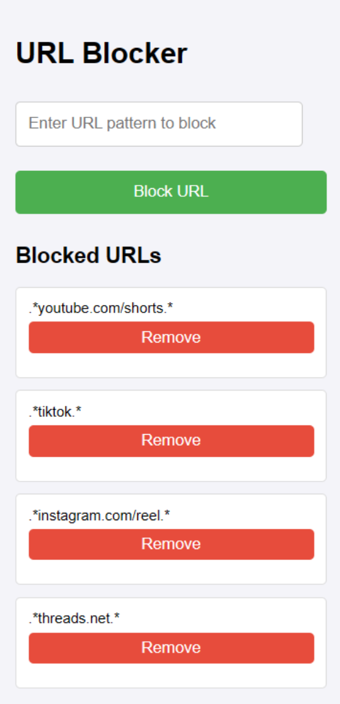

# Block Unwanted Content: Reclaim Your Time and Freedom

Are you tired of wasting countless hours on mindless, addictive content like YouTube Shorts, TikTok, Instagram Reels, and X.com? Do you feel the frustration of losing precious time to platforms designed to keep you hooked, draining your productivity and imprisoning your mind? This Chrome extension is here to help you break free from the clutches of big tech corporations and their time-sucking algorithms.

## Purpose

This Chrome extension is designed to block unwanted content that distracts you and saps your valuable time while ensuring your privacy and data are respected. **We do not collect any personal data or browsing history.**

**No data is collected in any form!**

By making this project open source, we offer users complete transparency. You can verify the truth of our claims by simply checking the source code.

**Transparency and data privacy are our top priorities.**

 By blocking sites like YouTube Shorts, TikTok, Instagram Reels, and X.com, you can take back control of your browsing experience and focus on what truly matters. These platforms are notorious for creating addictive environments, capturing your attention, and turning minutes into hours without you even realizing it. They are designed to maximize engagement at the cost of your life and mental well-being.

Join us in the fight against the mental prisons created by big tech corporations.

## How to Use

### Blocking a URL

1. **Enter the URL Pattern:**
   - In the text box labeled "Enter URL pattern to block", type the URL pattern that you want to block. For example, to block all pages from a specific website, you can use patterns like `.*youtube.com/shorts.*` or `.*tiktok.*`.

2. **Click "Block URL":**
   - After entering the URL pattern, click the green "Block URL" button. This will add the URL pattern to the list of blocked URLs.

### Managing Blocked URLs

- **Blocked URLs List:**
  - Below the "Block URL" button, you will see a list of all the blocked URLs. Each URL pattern that you have blocked will appear here.

- **Removing a URL:**
  - To remove a URL from the blocked list, click the red "Remove" button next to the URL pattern you want to unblock. This will remove the URL from the list and it will no longer be blocked.

### Default Blocked URLs

Here are some examples of how to use define a URL you might want block. Some of those are well know to steal our time more then we would want, so you can copy and paste from those example below if you want.
 
- `.*youtube.com/shorts.*`
- `.*tiktok.*`
- `.*instagram.com/reel.*`
- `.*threads.net.*`
- `.*x.com.*`

These default URLs can be enabled or disabled as needed, but cannot be removed from the list. To enable or disable these default blocked URLs, use the toggle button in the extension settings.

## Understanding `.*` in Regular Expressions

When using this extension to block URLs, you'll often see the pattern `.*` used in URL patterns. This is a regular expression (regex) syntax that is very powerful for matching a wide range of text. Here’s what it means:

- **`.` (Dot):** The dot character matches any single character except newline characters. It acts as a wildcard.
- **`*` (Asterisk):** The asterisk character is a quantifier that matches zero or more of the preceding element. In this case, it matches zero or more of any character (because it follows the dot).

### Combining `.` and `*`

When you put them together as `.*`, it means "match any sequence of characters, including none."

### Examples

Here are some examples of how `.*` can be used in URL patterns:

- **`.*youtube.com/shorts.*`**
  - **Meaning:** Match any URL that contains "youtube.com/shorts" anywhere in the URL.
  - **Example URLs Matched:**
    - `https://www.youtube.com/shorts/abcd1234`
    - `http://youtube.com/shorts/some-video`
    - `https://subdomain.youtube.com/shorts/another-video`

- **`.*tiktok.*`**
  - **Meaning:** Match any URL that contains "tiktok" anywhere in the URL.
  - **Example URLs Matched:**
    - `https://www.tiktok.com`
    - `http://m.tiktok.com`
    - `https://tiktok.com/user/someuser`

- **`.*instagram.com/reel.*`**
  - **Meaning:** Match any URL that contains "instagram.com/reel" anywhere in the URL.
  - **Example URLs Matched:**
    - `https://www.instagram.com/reel/abcd1234`
    - `http://instagram.com/reel/some-video`

- **`.*threads.net.*`**
  - **Meaning:** Match any URL that contains "threads.net" anywhere in the URL.
  - **Example URLs Matched:**
    - `https://www.threads.net/some-thread`
    - `http://threads.net/user/someuser`

### Why Use `.*`?

Using `.*` makes your URL blocking pattern very flexible and powerful. It ensures that any variation of the URL that contains the specified string will be matched and blocked. This is useful for sites that might use different subdomains or URL structures.

By understanding and using `.*`, you can effectively block a wide range of URLs with a single pattern.

### Notes

- **URL Pattern Format:**
  - The URL patterns use regular expressions. Make sure to use the correct format to match the URLs you want to block.

- **Refresh the Page:**
  - After blocking or unblocking a URL, you may need to refresh any open tabs for the changes to take effect.

## Features

- **Default Blocked URLs:** Out of the box, this extension blocks time-wasting platforms like YouTube Shorts, TikTok, Instagram Reels, and X.com. These defaults can be toggled on and off as needed.
- **Custom URL Blocking:** Users can add or remove their own list of blocked URLs to tailor the extension to their specific needs.
- **Simple User Interface:** An easy-to-use popup interface allows you to manage blocked URLs and toggle default settings with a single click.
- **Non-Removable Defaults:** Critical distractions are always kept at bay, but can be toggled if absolutely necessary.

### How You Can Help

- **Contribute Code:** Add new features, improve existing ones, or help with bug fixes.
- **Submit Ideas:** Share your thoughts on how we can make this extension more effective.
- **Spread the Word:** Let others know about this project so they can also benefit from it.
- **Collaborate:** Work with other developers to create a stronger, more resilient tool against digital distraction.

Let’s build a community-driven solution to break free from the grasp of big tech corporations.

## Installation

1. Clone the repository.
2. Open Chrome and navigate to `chrome://extensions/`.
3. Enable "Developer mode" at the top right corner.
4. Click "Load unpacked" and select the cloned directory.

## Contribution Guidelines

We welcome contributions from everyone. Please check out our [contribution guidelines](CONTRIBUTING.md) for more details on how to get started.

## License

This project is licensed under the MIT License - see the [LICENSE](LICENSE) file for details.

---
